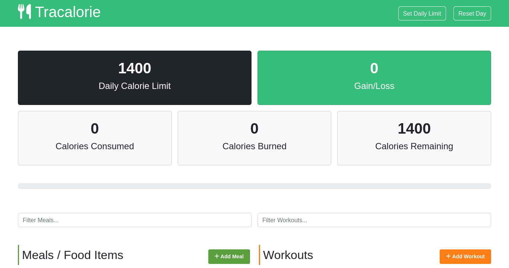

# Tracalorie App

Sideland : **## Tracalorie App**

### Overview :

- Take care of your health. Watch out your calories consumed with this app and balance the flow with workouts routine.

## Interest

You might be interested on how:

- **re-render** the DOM using vanilla javascript
-
- or **customiwing** kindly in Bootstrap , using the power of bootstrap...

### Links

- Solution URL: [https://github.com/BeinRain06/tracalorie-app.git](https://github.com/BeinRain06/tracalorie-app.git)
- Live Site URL: [https://beinrain06.github.io/tracalorie-app/](https://beinrain06.github.io/tracalorie-app/)

## Description : \* challenge issue

**style javascript effect progress bar**

I was confused when made a progress bar in bootstrap will bootstrap class of `progress` or `progress-bar` how to change background color of the **progessBar**.

- I proceed doing
  ` document.getElementById(`calorie-progress`).style.background= "red"`
  for example but it didn"t work.

**a hint**

> i have to use insted `percentage` and style **width** property rather than _backgrounnd_
>
> I obtain a result doing like :
> ` document.getElementById(`calorie-progress`).style.width= `${width}`%`

above the _width_ wrap by the dollar sign represent our calculated **width** that we assign to the style. And too notice the add of `%` after that to pass effectively this value as a `percentage`.

> **Re-render the DOM with vanilla Javascript**

Well that it is a urge learn and you definitely need to know about that . Well Vanilla looks kind of super fast to achieve static App. Now if you need vanilla to react to change **user** are making to the **dom** you will have to write your javascript in **class** object because only class have this power to re-render after the actual data inside is loaded.

> But To do so, we have after instanciating our class created somewhere outside the class

- e.g : `caloriesTracker = new CaloriesTracker();`

to lead back to our **class** and called inside **re-render** method thats inside will perform some action **displaying** and this method likely nee to be **private** to the class. See:

> ` class CaloriesTracker {

constructor() {
this.\_caloriesLimit = Storage.getCaloriesLimit();
this.\_totalRhytmCalories = Storage.getTotalRhytmCalories();
this.\_meals = Storage.getMeals();
...
}

// Public Method
addMeal(meal) {
this.\_totalRhytmCalories += meal.calories;
this.\_meals.push(meal);
this.\_displayNewMeal(meal);
**this.\_render()**;
...

}

// Private Method
\_render() {
this.\_displayTotalRhytmCalories();
this.\_displayCaloriesBurned();
this.\_displayCaloriesConsumed();
this.\_displayCaloriesRemaining();
this.\_displayCaloriesProgress();
}
}`

Doing that we can for our case re-render the **stats** (caloriesConsumed, ...) that deal with the method **addMeal()**

## Javascript structure:

> - two main components `index.js`, `breakkout,js`

## css structure:

> mainly Bootstrap
> style.css file

**Picture**

---

---

# What I learned

### First time using webpack

i learn basic configuration with `webpack` **frontend environment**. How to use **web.confg.js** file to set parameters as :

- **loaders** (css-loader, style-loaders)
- add **plugin** to use extra features of webpack ( mini-css-extract-plugin, html-webpack-plugin)
- configure the **scripts** for the **development mode** and the **production mode**
- set **webpack live development server**

### use power of bootstrap

You cannot just googling on bootstrap everitime you want to find information about e.g implementing a new color, a modal. a progress bar, or media queries.
You can just **downlodad** file such as :

- bootstrap.css & bootstrap.css.map
- bootstrap-utilities.css & bootstrap-utilities.css.map
- bootstrap-reboot.css & bootstrap-reboot.css.map
- bootstrap-grid.css & bootstrap-grid.css.map

or whatever you just need in your project
and Include this/thes file in you `css` style folder . Then will coding , check for the necessary information on these files rather than go once again online

### Mobile Responsiveness

    - Mobile reponsiveness for mobile min-width: 210px

**Picture**

---

---

## Callback History:

- **lose weight** the real step to lose weight is to burn calories not to drink a wizard liquor like must rely on their thoughts. Actually this app is a best fit to control our rate of calories and added to a section of workout really reshape our body.

Remember, a body in health a mind in boost.
Don't forget to treat yourself for the future nice person you believe.

> Well isn-t a **callback story** but i tried to make you figure out something nice!

## Useful Resources :

- brad traversy[udemy] : modern javascript course , lead us to this beautifull app

- brad traversy[youtube] : [https://www.youtube.com/watch?v=IZGNcSuwBZs&t=458s](https://www.youtube.com/watch?v=IZGNcSuwBZs&t=458s) : With this article we learn how to configure basically our **front end environment** using **webpack**. A great resource.

## Acknowledge:

This project always remember the Team :

-Brad Traversy: vanilla javascript course on udemy, well explain our game

_Our Work always remember this team_

- `Brad Traversy` for his tutorial and use of vanilla course
  >
- `WittCode` with his easy explanation how works webpack with **React**
  >

## Author

- Frontend Mentor - [https://www.frontendmentor.io/profile/BeinRain06](https://www.frontendmentor.io/profile/BeinRain06)
- Twitter - [https://twitter.com/nest_Ngoueni](https://twitter.com/nest_Ngoueni)
